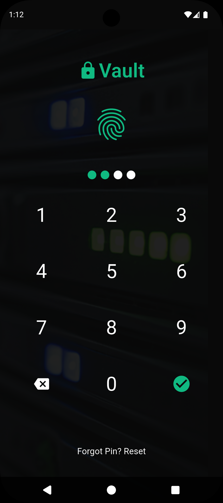
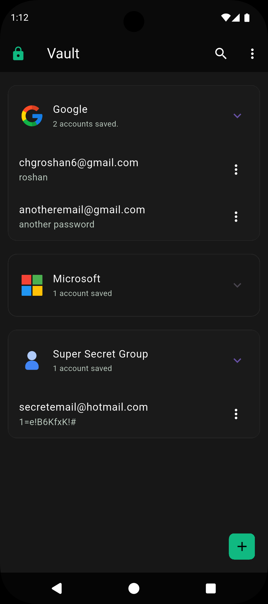
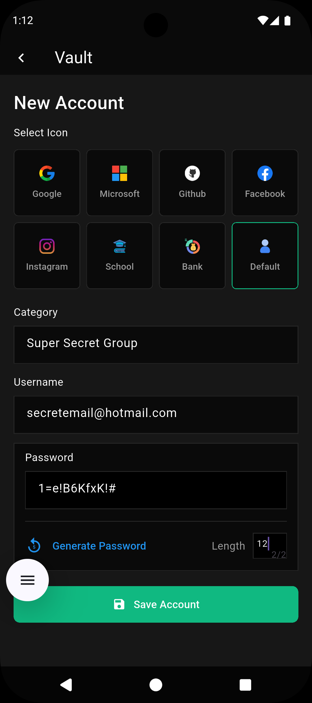

# Vault – Minimalistic Offline Password Manager

Vault is a lightweight, fully offline password manager built with Flutter. It is designed to organize account credentials in a clean and searchable interface, replacing the need to store passwords in notes applications.

The app focuses on convenience and organization rather than enterprise-grade encryption. A simple PIN lock and optional biometric authentication help prevent accidental access and unintended modifications, while allowing users to retrieve passwords in just one or two taps.

---

## Screenshots & Features

### Login Page



Users can unlock the application using a PIN or fingerprint authentication.

**Features:**

- PIN-based lock to prevent accidental interactions
- Biometric login
- Fast and convenient access

---

### Home Page



The home page displays all saved credentials grouped by category in expandable sections.

**Features:**

- Credentials organized by category
- Expandable/collapsible category groups
- Search categories in real time
- Copy passwords to clipboard with one tap
- Edit or delete saved credentials
- Export all credentials to CSV
- Clear all stored data
- Logout

---

### Category Search

Typing in the search field instantly filters the category list for quick access to stored accounts.

**Features:**

- Real-time search
- Dynamic list filtering
- Faster credential retrieval

---

### Add Account Page



Users can create new credential entries by selecting a category, username, password, and service icon.

**Features:**

- Add category name
- Enter username/email
- Enter password
- Select service icon
- Supports 7 predefined icons plus a default icon

---

### Password Generator

The password input field includes a built-in random password generator.

**Features:**

- Generate secure random passwords
- Adjustable length from 8 to 32 characters
- One-tap insertion into password field

---

### Edit Credential

    Stored Password can be changed.

---

## Core Features

- Fully offline password storage
- Credential organization by category
- Real-time category search
- One-tap password copying
- Add, edit, and delete credentials
- Built-in password generator
- CSV export
- PIN lock to prevent accidental changes
- Biometric login
- Database reset and logout

---

## Design Philosophy

Vault is intended as a practical and organized replacement for storing credentials in notes applications.

The PIN system is not meant to provide strong cryptographic security. Instead, it prevents accidental edits or exposure in situations such as unintended touches while the phone is in a pocket.

Passwords can be accessed quickly:

- One tap to copy when the credential is visible
- At most two taps to navigate to and retrieve a password

---

## Tools & Technologies Used

### Development Framework

- Flutter
- Dart

### Local Database

- SQLite

### Authentication

- PIN lock
- Biometric authentication

### Utilities

- Clipboard API
- CSV export

### Development Tools

- Visual Studio Code

### Version Control

- Git
- GitHub

---

## Architecture & Code Organization

```text
lib/
├── pages/
├── enums/
├── classes/
├── passwordGenerator.dart
├── exporter.dart
├── dbHandling.dart
├── helper.dart
├── SomeConstants.dart
└── main.dart
```

---

## Data Storage

All credentials are stored locally using SQLite. No internet connection or cloud service is required, and all information remains on the user's device.

Exported credentials can be found in "/storage/emulated/0/Android/data/com.example.vault/files/"

---

## Security Note

Vault is designed for convenience and organization, not for high-security use cases.

- Data is stored locally.
- PIN lock is intended to prevent accidental access.
- Biometric authentication provides faster unlocking.
- Credentials are not intended for sensitive enterprise environments.

---
